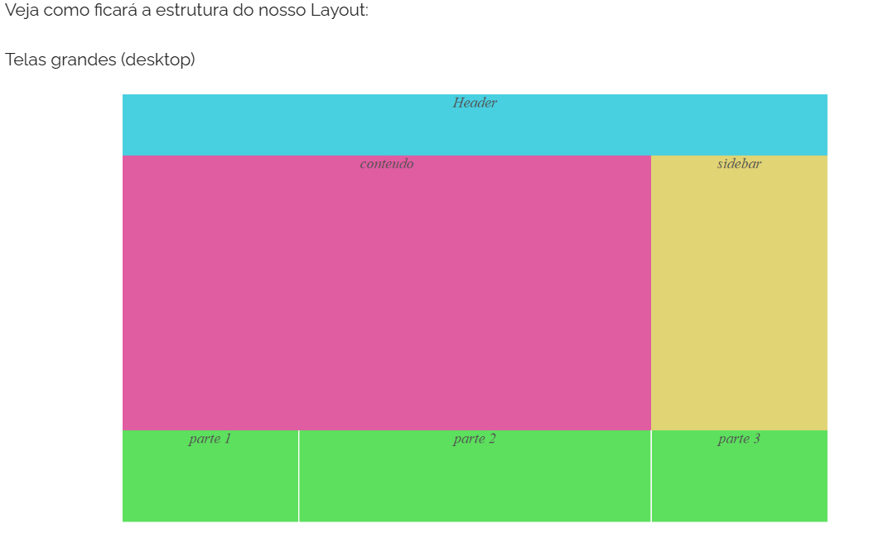
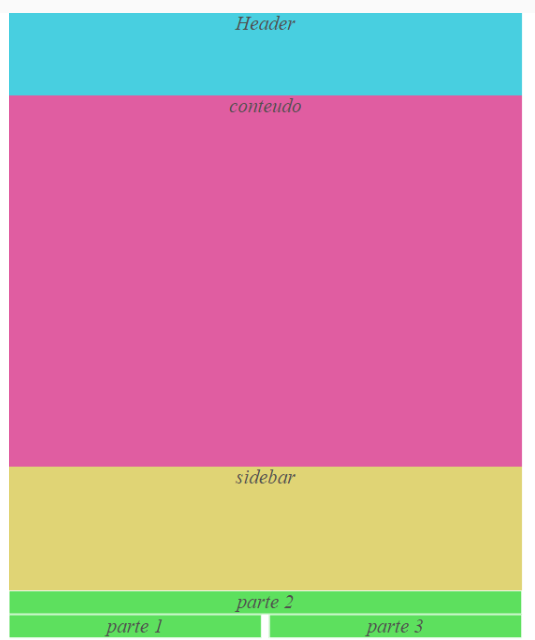
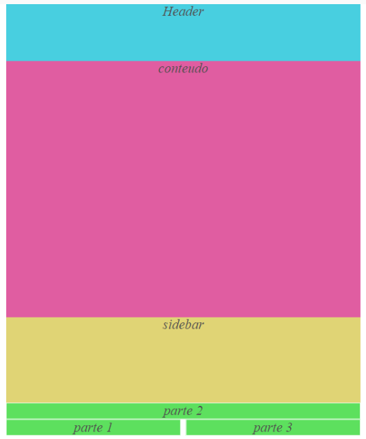

## Estudo Prático

Utilização e aplicação eficaz de flexbox e CSS Grid Layout

A utilização de Flexbox é recomenda quando for necessária a organização de elementos em uma única direção, seja na horizontal ou vertical.

O CSS Grid Layout torna-se mais adequada na situação em que seja necessário a organização em duas direções (linha e coluna).

---

Este projeto web promove o entendimento da aplicação das duas técnicas.
Constitui-se uma página web simples com layout responsivo através de CSS Grid (row - coluns).
No "<footer>" é feita com flexbox para ser organizado em apenas uma direção.

---

Referências:

https://www.treinaweb.com.br/blog/criando-a-estrutura-de-um-layout-com-css-grid-e-flexbox
